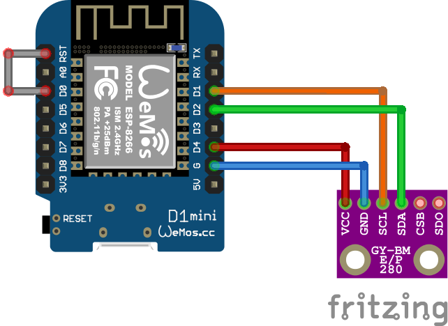

# Low-Power Environment Sensor

## Features

- Aquire sensor data
- Send sensor data to MQTT-broker

## Wire Diagram

## References

- [Bosch Sensortec: BME280 Humidity Sensor](https://www.bosch-sensortec.com/products/environmental-sensors/humidity-sensors-bme280/)
- [DIYI0T: How to reduce the ESP8266 power consumption?](https://diyi0t.com/how-to-reduce-the-esp8266-power-consumption/)